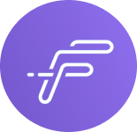
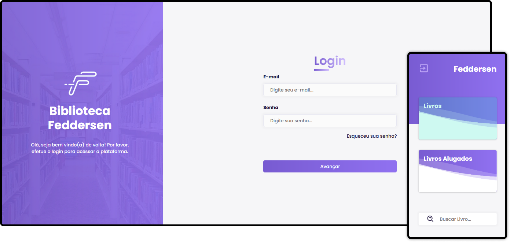

<h1 align="center">
     
    <strong>Feddersen</strong>
</h1>

 

  

## 🚀 Tecnologias

Esse projeto foi desenvolvido com as seguintes tecnologias:

- HTML5
- CSS3
- JavaScript
- SASS

## 💻 Projeto

O Feddersen é o Layout de uma aplicação que tem como objetivo gerenciar a biblioteca de uma escola Publica. Esse projeto foi desenvolvido de forma voluntária a escola (funcionalidades ainda pendentes, futuramente receberá uma atualização de tecnologias!)

## 🔖 Layout

Você pode visualizar o layout do projeto através <a href="https://www.figma.com/file/mYWfo9x3mZewr8KkY6KTM9/Feddersen?node-id=0%3A1">desse link</a>. Lembrando que você precisa ter uma conta no Figma para acessá-lo.

## Licença

Esse projeto está sob a licença MIT. Veja o arquivo [LICENSE](LICENSE.md) para mais detalhes.
